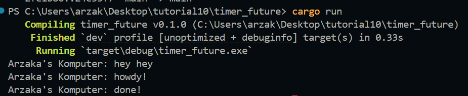
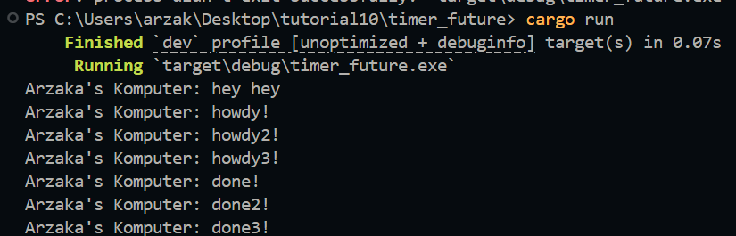

# Tutorial 10 - Timer

## 1.2 Understanding How It Works

Ketika dilakukan cargo run, hal pertama yang di-_print_ adalah `Arzaka's Komputer: hey hey`. Hal ini dapat terjadi karena perintah _print_ tersebut terletak di luar async block walaupun berada di bawahnya. Hal ini mennyebabkan perintah tersebut dieksekusi secara _synchronous_ dan langsung. Setelah itu, `executor.run()` baru memproses hal-hal yang dilakukan oleh `spawner.spawn()`

## 1.3 Multiple Spawn and removing drop

Saat ini terdapat 3 buah spawner. Semua spawner akan dijalankan secara serentak ketika `executor.run()` dijalankan sehingga yang ter-print adalah howdy!, howdy2!, dan howdy3! terlebih dahulu. Setelah 2 detik kemudian, baru muncul output done!, done1!, dan done2!. Lalu, tanpa adanya drop spawner maka execution tidak akan berhenti.